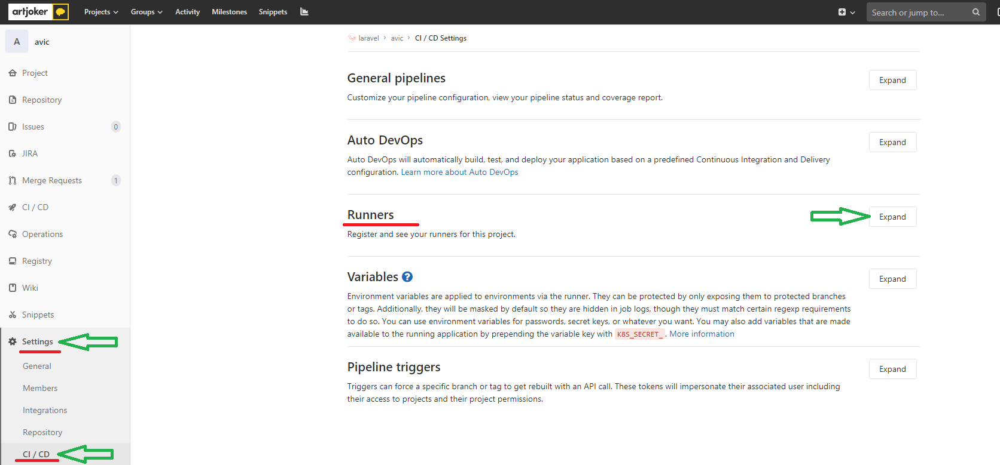
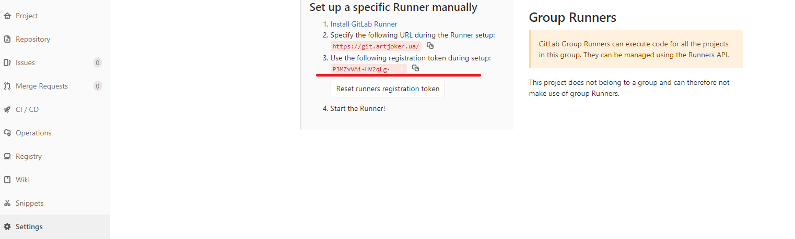

# Инструкция запуска персоналного gitlab-runner
### Шаг первый склонировать репозиторий  cli runner
```git clone git@git.artjoker.ua:erik/cli-runner.git&&cd cli-runner``` 
### Выполнить runner cli
```./run.sh -a```

#### Set project name : myproject_name
#### Set runner tocken:  

##Инструкция получения runner tocken приведена  на скриншотах 

# STEP1

- Step 1

# STEP2
 
- Step 2
